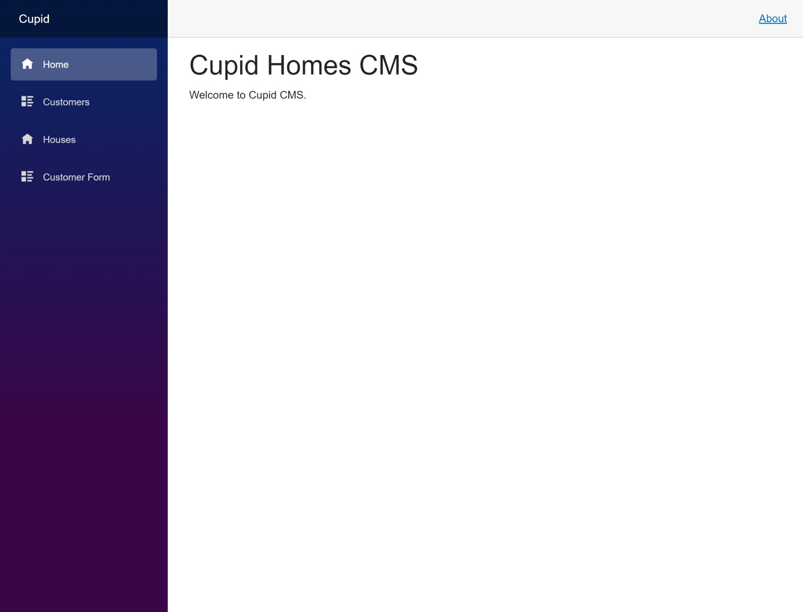
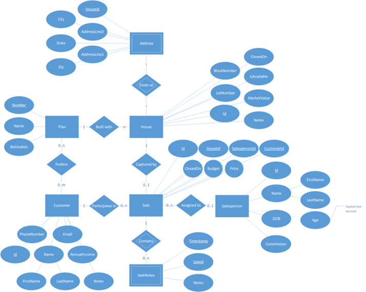
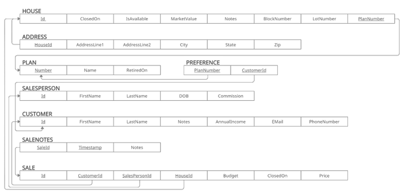

# Cupid
ASP.NET Minimal API and corresponding Blazor Server client demo

## Build
### Configuration
You must set configuration variables for the project to work properly. You may either create appsettings.json, or use dotnet secrets manager.

- To use user secrets, right click the project in the Solution Explorer > "Manage User Secrets" and save the contents in the ``secrets.json`` file that opens. Alternatively, you may use the command line.
- To use appsettings.json, create an appsettings.json file in the same directory as the project you want to set configuration files for.

#### Cupid
|Api|
|---|
|API Address (Example: https://localhost:7092)|

#### Cupid.Api
|ConnectionStrings:Cupid|RandomApi|
|---|---|
|Database Connection String|https://random-data-api.com/api/v2/|

### Debug
Open in Visual Studio and click the green arrow to debug. Debug each project individually by default, or right-click the solution in Solution Explorer > Set Startup Projects to debug or run the API and the Blazor Server project simultaneously.

### Run
Navigate to Cupid.Api and Cupid, respectively, and run ``dotnet run``.

Navigate to /swagger/index.html on the API to view the schema and test the API.

## Connect a database
You must connect a SQL Server aas your database, though the project can be easily modified to work with a different database provider. If this is something you need, please see the [EFCore documentation](https://learn.microsoft.com/en-us/ef/core/providers/) on how to connect a different database provider.

Once you have setup a connection to a valid database, use the dotnet ef migrations tool to run the migrations on the database. You can find documentation for this tool [here](https://learn.microsoft.com/en-us/ef/core/managing-schemas/migrations/).

## ER Diagram

## Schema

